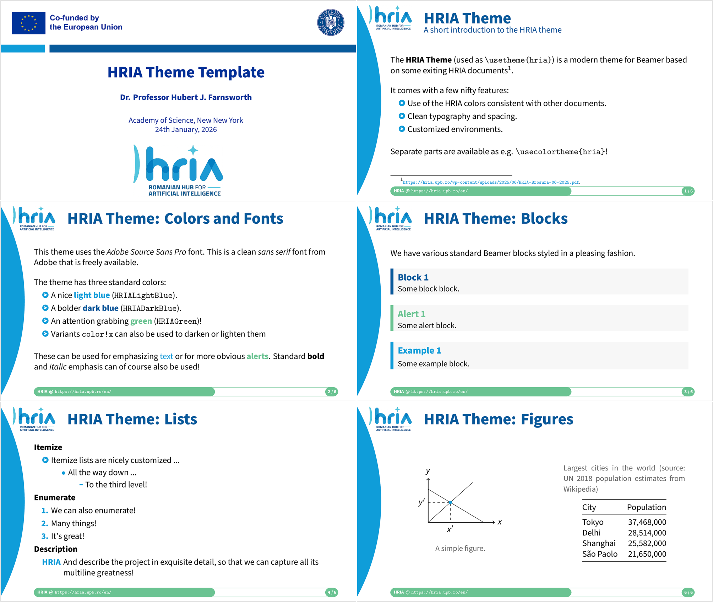

# HRIA Beamer Theme

> [!NOTE]
> This template style is fairly complete and working well, but any feature requests
> or bug reports to improve it are **very welcome**! The theme should adjust to
> various aspect ratios and page sizes.

## What it Looks Like

[Full PDF](template.pdf)

## How to Use It

Copy the `beamerthemehria.sty` and the accompanying `beamercolorthemehria.sty` file
to your local directory together with any relevant assets from the `assets` folder. You can
use the `template.tex` file to get you started with a few useful options and examples.
The `template.tex` can then be built with `PDFLaTeX` (or `XeLaTeX` or `LuaLaTeX`
for the adventurous).

The package defines the following options used as `\usetheme[opts]{hria}`.

| Option                            | Description                           |
| :-                                | :-                                    |
| `language=<lang>`                 | One of *english* or *romanian*        |
| `showframe`                       | Shows a frame around page elements (margins, etc.) |
| `layoutgrid`                      | Adds a debug grid to check alignment  |

The `language` is used to automatically select the logos with appropriate text.
This can be avoided by providing your own logos using the following commands,
but care must be taken to size them nicely.

| Macro                             | Description                           |
| :-                                | :-                                    |
| `\venue`                          | Venue name (for the presentation) in footer |

## License

Creative Commons Attribution 4.0 International
